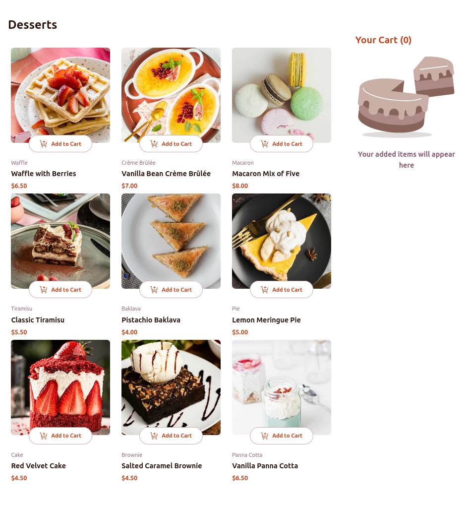

# Frontend Mentor - Product list with cart solution

This is a solution to the [Product list with cart challenge on Frontend Mentor](https://www.frontendmentor.io/challenges/product-list-with-cart-5MmqLVAp_d). Frontend Mentor challenges help you improve your coding skills by building realistic projects. 

## Table of contents

- [Overview](#overview)
  - [The challenge](#the-challenge)
  - [Screenshot](#screenshot)
  - [Links](#links)
- [My process](#my-process)
  - [Built with](#built-with)
  - [What I learned](#what-i-learned)
  - [Useful resources](#useful-resources)
- [Author](#author)

## Overview

### The challenge

Users should be able to:

- Add items to the cart and remove them
- Increase/decrease the number of items in the cart
- See an order confirmation modal when they click "Confirm Order"
- Reset their selections when they click "Start New Order"
- View the optimal layout for the interface depending on their device's screen size
- See hover and focus states for all interactive elements on the page

### Screenshot

### Links

- Solution URL: [https://github.com/CoderAlchemy24/frm-cakes-ordering.git](https://github.com/CoderAlchemy24/frm-cakes-ordering.git)
- Live Site URL: [https://remarkable-biscochitos-a43a20.netlify.app/](https://remarkable-biscochitos-a43a20.netlify.app/)

## My process

### Built with

- [React](https://reactjs.org/) - JS library
- TailwindCSS

### What I learned

TailwindCSS 

### Useful resources

- [TailwindCSS v.4.1](https://tailwindcss.com/) - This helped me for using TailwindCSS with React

## Author

- Frontend Mentor - [@coderalchemy24](https://www.frontendmentor.io/profile/CoderAlchemy24)

